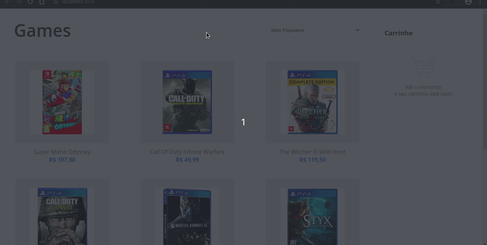

<h1 align="center">Games</h1>

<h2 align="center">Compre os melhores jogos pelos melhores preços</h2>

<p align="center">
    <a href="https://nodejs.org/en/">
        
    </a>
</p>

<p align="center">
    <a href="https://vuejs.org/">
        
    </a>
</p>

## Sumário

- [Sumário](#sumário)
- [:books: Sobre](#books-sobre)
- [:robot: Técnologias](#robot-técnologias)
- [:question: Como executar](#question-como-executar)
- [:computer: Visão Geral](#computer-visão-geral)

<a id="sobre"></a>
## :books: Sobre

Página de simples de e-comerce para venda de jogos eletrônicos.

<a id="tecnologias"></a>
## :robot: Técnologias

As principais técnologias utilizadas foram:

- [Node.js](https://nodejs.org/en/)
- [ReactJS](https://pt-br.reactjs.org/)

## :question: Como executar

- #### **Requisitos**
    - Ter o [Node.js](https://nodejs.org/en/)
    - Ter um gerenciador de pacotes [NPM](https://www.npmjs.com/) ou [Yarn](https://yarnpkg.com/)
    - Ter o [Json-Server](https://www.npmjs.com/package/json-server) (instalar de forma global)
    

- #### Faça um clone
```sh
  $ git clone https://github.com/jeovane16/consulta_remedios_teste.git
```

- #### Execute os comandos (de preferência na ordem mostrada) 

```sh
  # Entre na pasta backend
  $ cd backend

  # Execute o comando para instalar as depencias
  $ npm install

  # Execute o comando para executar o server
  $ npm start

  # Entre na pasta frontend
  $ cd frontend

  # Execute o comando para instalar as depencias
  $ npm install

  # Inicie a aplicação frontend
  $ npm start
```

<a id="visao-geral"></a>
## :computer: Visão Geral

<h1 align="center">
    
</h1>
